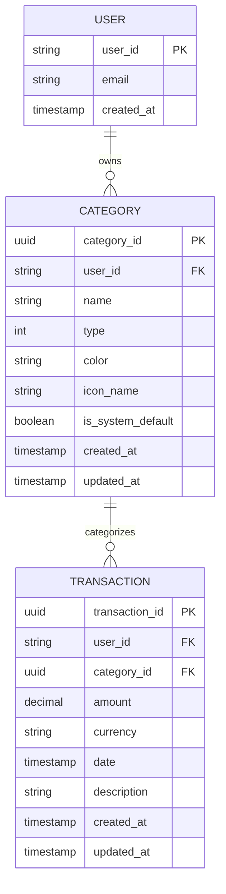

# Data Model: Category Management

**Feature**: 002-category-management | **Phase**: 1 (Design) | **Date**: March 7, 2026

---

## Entity Relationship Diagram



---

## Domain Layer Entities

### Category Aggregate Root

```csharp
/// <summary>
/// Category aggregate root representing an expense or income category.
/// System categories (IsSystemDefault=true) are immutable.
/// Custom categories can be created, updated, and deleted (if no transactions reference them).
/// </summary>
public class Category : AggregateRoot
{
    /// <summary>Unique identifier for this category (strong-typed ID)</summary>
    public CategoryId Id { get; private set; }
    
    /// <summary>User who owns this category (scopes to tenant)</summary>
    public UserId UserId { get; private set; }
    
    /// <summary>Category name (1-50 chars, unique per user)</summary>
    public CategoryName Name { get; private set; }
    
    /// <summary>Income or Expense classification</summary>
    public CategoryType Type { get; private set; }
    
    /// <summary>Hex color code for UI display (#RRGGBB format)</summary>
    public ColorHex Color { get; private set; }
    
    /// <summary>Bootstrap icon name (e.g., "credit-card", "home")</summary>
    public string IconName { get; private set; }
    
    /// <summary>True if this is a system-default category (immutable)</summary>
    public bool IsSystemDefault { get; private set; }
    
    /// <summary>UTC timestamp of creation (set by database trigger)</summary>
    public DateTime CreatedAt { get; private set; }
    
    /// <summary>UTC timestamp of last update (set by database trigger)</summary>
    public DateTime UpdatedAt { get; private set; }

    /// <summary>
    /// Create a new category.
    /// </summary>
    /// <param name="id">Unique identifier</param>
    /// <param name="userId">User who owns this category</param>
    /// <param name="name">Category name (validated by CategoryName ValueObject)</param>
    /// <param name="type">Income or Expense</param>
    /// <param name="color">Hex color (validated by ColorHex ValueObject)</param>
    /// <param name="iconName">Icon name from available library</param>
    /// <param name="isSystemDefault">True only for seeded system defaults</param>
    public Category(
        CategoryId id,
        UserId userId,
        CategoryName name,
        CategoryType type,
        ColorHex color,
        string iconName,
        bool isSystemDefault = false)
    {
        if (string.IsNullOrWhiteSpace(iconName))
            throw new DomainException("Icon name is required.");

        Id = id;
        UserId = userId;
        Name = name;
        Type = type;
        Color = color;
        IconName = iconName;
        IsSystemDefault = isSystemDefault;
    }

    /// <summary>
    /// Guard method: determines if this category can be deleted.
    /// </summary>
    /// <param name="hasTransactions">True if this category has associated transactions</param>
    /// <returns>True if deletion is allowed; false if blocked by system default or pending transactions</returns>
    public bool CanDelete(bool hasTransactions)
    {
        if (IsSystemDefault)
            return false; // System categories cannot be deleted
        
        if (hasTransactions)
            return false; // Categories with transactions cannot be deleted
        
        return true; // Custom category with no transactions can be deleted
    }

    /// <summary>
    /// Update category properties (name, color, icon). Type and IsSystemDefault cannot change.
    /// </summary>
    public void Update(CategoryName newName, ColorHex newColor, string newIconName)
    {
        if (string.IsNullOrWhiteSpace(newIconName))
            throw new DomainException("Icon name is required.");

        Name = newName;
        Color = newColor;
        IconName = newIconName;
        // Type and IsSystemDefault intentionally not updated (invariant)
    }
}

public enum CategoryType
{
    Income = 0,
    Expense = 1
}
```

---

## Value Objects

### CategoryId

```csharp
/// <summary>Strong-typed ID for Category entities (prevents ID mixing at compile time)</summary>
public record CategoryId(Guid Value)
{
    /// <summary>Create a new CategoryId from guid</summary>
    public CategoryId() : this(Guid.NewGuid()) { }

    /// <summary>Parameterless constructor prohibited; use explicit Guid wrapper</summary>
    static CategoryId() { }
}
```

### CategoryName

```csharp
/// <summary>
/// Validated category name value object.
/// Rules: 1-50 characters, non-empty after trim.
/// </summary>
public record CategoryName(string Value)
{
    public const int MaxLength = 50;
    public const int MinLength = 1;

    /// <summary>Create a validated category name</summary>
    /// <param name="name">Name to validate</param>
    /// <returns>Validated CategoryName value object</returns>
    /// <exception cref="DomainException">If validation fails</exception>
    public static CategoryName Create(string name)
    {
        var trimmed = name?.Trim() ?? string.Empty;

        if (string.IsNullOrWhiteSpace(trimmed))
            throw new DomainException("Category name is required.");

        if (trimmed.Length < MinLength)
            throw new DomainException($"Category name must be at least {MinLength} character.");

        if (trimmed.Length > MaxLength)
            throw new DomainException($"Category name must not exceed {MaxLength} characters.");

        return new CategoryName(trimmed);
    }
}
```

### ColorHex

```csharp
/// <summary>
/// Validated hex color value object.
/// Format: #RRGGBB (e.g., "#F39C12", "#E74C3C")
/// Uppercase letters only for consistency.
/// </summary>
public record ColorHex(string Value)
{
    private static readonly Regex HexColorRegex = new(@"^#[0-9A-F]{6}$", RegexOptions.Compiled);

    /// <summary>Create a validated hex color</summary>
    /// <param name="hex">Hex color code to validate</param>
    /// <returns>Validated ColorHex value object</returns>
    /// <exception cref="DomainException">If format invalid</exception>
    public static ColorHex Create(string hex)
    {
        if (string.IsNullOrWhiteSpace(hex))
            throw new DomainException("Color hex code is required.");

        var normalized = hex.ToUpperInvariant();

        if (!HexColorRegex.IsMatch(normalized))
            throw new DomainException("Color must be valid hex code (format: #RRGGBB, e.g., #F39C12).");

        return new ColorHex(normalized);
    }
}
```

---

## Database Schema

### Categories Table

```sql
-- Supabase PostgreSQL table
CREATE TABLE IF NOT EXISTS categories (
    category_id UUID PRIMARY KEY DEFAULT gen_random_uuid(),
    user_id TEXT NOT NULL,  -- Supabase user ID
    name TEXT NOT NULL,
    type INT NOT NULL,      -- 0 = Income, 1 = Expense
    color TEXT NOT NULL,    -- Hex format: #RRGGBB
    icon_name TEXT NOT NULL,
    is_system_default BOOLEAN NOT NULL DEFAULT false,
    created_at TIMESTAMP WITH TIME ZONE NOT NULL DEFAULT now(),
    updated_at TIMESTAMP WITH TIME ZONE NOT NULL DEFAULT now(),
    
    CONSTRAINT fk_user FOREIGN KEY (user_id) REFERENCES auth.users(id) ON DELETE CASCADE,
    CONSTRAINT unique_name_per_user UNIQUE (user_id, name),
    CONSTRAINT valid_color CHECK (color ~ '^#[0-9A-F]{6}$'),
    CONSTRAINT valid_type CHECK (type IN (0, 1))
);

-- Indexes for performance
CREATE INDEX idx_categories_user_id ON categories(user_id);
CREATE INDEX idx_categories_type ON categories(type);
CREATE INDEX idx_categories_is_system_default ON categories(is_system_default);

-- Auto-update trigger for updated_at
CREATE TRIGGER update_categories_updated_at
BEFORE UPDATE ON categories
FOR EACH ROW
EXECUTE FUNCTION update_updated_at_column();
```

### Foreign Key Relationship

```sql
-- transactions table references categories
ALTER TABLE transactions
ADD CONSTRAINT fk_transaction_category
FOREIGN KEY (category_id) REFERENCES categories(category_id) ON DELETE RESTRICT;
-- ON DELETE RESTRICT prevents deletion of categories with pending transactions (enforced at DB level)
```

---

## 24 System Default Categories

Seeded during database initialization (see migration file):

| Group | #Category | Icon | Color | Type |
|-------|-----------|------|-------|------|
| **💰 Income** | 1. Salary | building-dollar | #27AE60 | Income |
| | 2. Sales | shopping-bag | #27AE60 | Income |
| | 3. Investments | trending-up | #27AE60 | Income |
| | 4. Gifts | gift | #27AE60 | Income |
| | 5. Other Income | star | #27AE60 | Income |
| **🏠 Fixed Expenses** | 6. Housing | home | #E74C3C | Expense |
| | 7. Utilities | lightbulb | #E74C3C | Expense |
| | 8. Insurance | shield | #E74C3C | Expense |
| | 9. Subscriptions | repeat | #E74C3C | Expense |
| | 10. Education | book | #E74C3C | Expense |
| **🛒 Variable Expenses** | 11. Groceries | shopping-cart | #F39C12 | Expense |
| | 12. Transportation | car | #F39C12 | Expense |
| | 13. Personal Care | scissors | #F39C12 | Expense |
| | 14. Home | wrench | #F39C12 | Expense |
| | 15. Pets | paw | #F39C12 | Expense |
| **🎭 Lifestyle & Leisure** | 16. Restaurants | utensils | #9B59B6 | Expense |
| | 17. Entertainment | star | #9B59B6 | Expense |
| | 18. Shopping | shopping-bags | #9B59B6 | Expense |
| | 19. Travel | plane | #9B59B6 | Expense |
| | 20. Health & Wellness | heart | #9B59B6 | Expense |
| **📉 Finance & Other** | 21. Debt Payments | credit-card | #34495E | Expense |
| | 22. Savings & Investment | piggy-bank | #34495E | Expense |
| | 23. Donations | hands-helping | #34495E | Expense |
| | 24. Unexpected Expenses | exclamation-circle | #34495E | Expense |

All 24 marked with `is_system_default = true` and immutable (no update/delete).

---

## Validation Rules Summary

| Rule | Layer | Enforcement |
|------|-------|-------------|
| Name: 1-50 chars, non-empty | Domain (CategoryName VO) | Throw DomainException on construct |
| Unique name per user | Domain (CategoryService.ValidateUniqueName) | Mocked repository query; throw if duplicate |
| Color: #RRGGBB format | Domain (ColorHex VO) | Throw DomainException on construct |
| Icon: must be valid | Application (Handler) | Validate against allowed icon list |
| Type: Income \| Expense | Domain (CategoryType enum) | Enforced at compile time |
| IsSystemDefault: immutable | Domain (CanDelete guard) | Return false if IsSystemDefault=true |
| Delete: only if no transactions | Domain (CategoryService.CanDeleteCategory) | Query transaction count; return bool guard |
| User isolation (tenant) | Infrastructure (Repository) + Application (Handler) | Filter by UserId in all queries |

